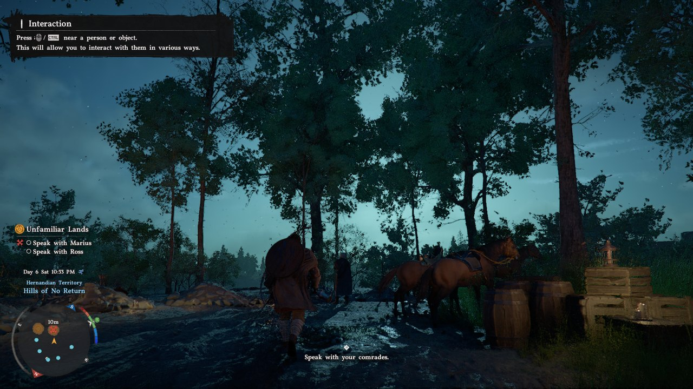
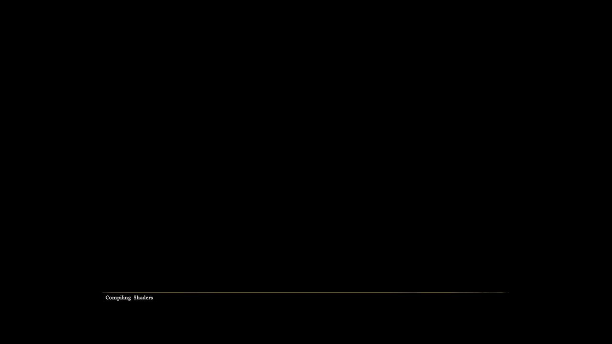
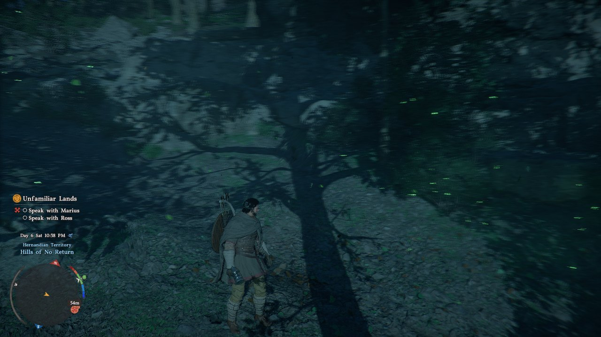

# Crimson Desert on a Radeon RX 580

**Crimson Desert refuses to start on AMD Polaris cards.** This makes it run.

[](https://github.com/Vidith007/RX-580-CRIMSON-DESERT-FIX/releases/latest/download/Crimson-Desert-RX580-Fix.zip)
[](https://vidith007.github.io/RX-580-CRIMSON-DESERT-FIX/)


<table>
<tr>
<td width="50%" align="center"><br><sub><b>Before</b> — the game never gets past a black frame</sub></td>
<td width="50%" align="center"><br><sub><b>After</b> — gameplay, daylight, full terrain and foliage</sub></td>
</tr>
</table>

The game asks for Direct3D 12 **feature level 12_1** and **native 16-bit float** shaders. An
RX 580 has neither. It's not that the game runs badly on Polaris — it checks, doesn't like the
answer, and stops.

This is a D3D12 translation shim that sits in front of the game, answers those capability
questions differently, and then repairs every place where that answer turns out to be a lie.
There were twelve such places. The game now reaches gameplay and renders correctly in daylight
and at night, with no missing or substituted textures.

---

## Read this before you install

> [!WARNING]
> **If you have an RX 5000 series or newer, do not install this.** RDNA and later report
> feature level 12_1 natively. This fix exists only to paper over gaps that Polaris has and
> newer cards don't — on those cards it can only make things worse.

> [!CAUTION]
> This has been tested on **exactly one machine**: an RX 580 2048SP with 8 GB of system RAM,
> over seven days. It is unofficial, unaffiliated with AMD, Valve or Pearl Abyss, and
> warranted for nothing. **Keep a backup of anything you overwrite.**

---

## Requirements

| | |
|---|---|
| **GPU** | AMD Polaris / GCN4 — RX 470, 480, 570, 580, 580 2048SP, 590 |
| **Driver** | AMD Radeon Software, stock and unmodified. Needs `amdvlk64.dll` present |
| **OS** | Windows 10 or 11, 64-bit |
| **RAM** | 8 GB works but is tight. 16 GB is more comfortable |
| **Game** | Crimson Desert, PC, GameVersion **1.14.00** |

No installer, no registry writes, no game file is modified. Five loose files go into your
`bin64` folder; deleting them puts you exactly back where you started.

---

## Install

### 1. Download and unzip

**[Download Crimson-Desert-RX580-Fix.zip](https://github.com/Vidith007/RX-580-CRIMSON-DESERT-FIX/releases/latest/download/Crimson-Desert-RX580-Fix.zip)** — v1.0.0, 3.6 MB.
Verify it before you use it: [checksums](#verify-your-download). Older versions and full release
notes are on the [releases page](https://github.com/Vidith007/RX-580-CRIMSON-DESERT-FIX/releases).

### 2. Back up first

Open the folder containing `CrimsonDesert.exe` — usually:

```
...\Crimson Desert\bin64\
```

If any file you're about to copy is already there, **move the original into a
`backup-original\` folder.** That's your revert path and it's the only one you get.

### 3. Copy the files in

Copy everything inside `fix\` into `bin64`, so you end up with:

```
...\Crimson Desert\bin64\
    CrimsonDesert.exe                 (already there, untouched)
    d3d12.dll                         <- from fix\
    dxgi.dll                          <- from fix\
    dx12bridge.ini                    <- from fix\
    Play Crimson Desert (RX 580).cmd  <- from fix\
    vkd3d\
        d3d12.dll                     <- from fix\vkd3d\
        d3d12core.dll                 <- from fix\vkd3d\
```

> [!IMPORTANT]
> **Keep the `vkd3d\` subfolder nested.** Line 35 of `dx12bridge.ini` reads
> `RealD3D12=vkd3d\d3d12.dll`. Flatten it and nothing loads.

### 4. Empty the AMD shader cache

Delete the **contents** of this folder — keep the folder itself:

```
%LOCALAPPDATA%\AMD\DxcCache
```

> [!IMPORTANT]
> **This step matters more than any other on this page.** That cache has no size limit. On the
> test machine it reached **4.0 GB**, and the game then committed **30,916 MB against a
> 32,318 MB Windows commit limit** — 805 MB of headroom. The shader-compile worker died
> silently and the game sat on *"Compiling Shaders"* forever, at 82 fps, drawing a black frame.
> It never crashed and never timed out. Emptying the cache dropped peak commit to **8,768 MB**
> and the game started working.

> [!WARNING]
> **Never delete `%LOCALAPPDATA%\AMD\DxCache`** — note the spelling, no second `c`. Different
> folder, held open by the Radeon service.

### 5. Launch

Run **`Play Crimson Desert (RX 580).cmd`** from `bin64`.

It measures both AMD cache folders, empties them only if they're over budget, prints your free
RAM and commit headroom, then starts the game. It refuses to delete anything whose path isn't
literally `...\AMD\DxcCache` or `...\AMD\VkCache`.

It's a plain text file that deletes things. **Open it in Notepad and read it first** — you
shouldn't run a script from a stranger that deletes things, and this one deletes things.
[`fix/cache-guard-notes.md`](fix/cache-guard-notes.md) explains every decision in it.

You can also just start the game normally. The launcher is convenience, not a requirement.

### 6. Expect a slow first launch

Every shader compiles from scratch. Later launches are much faster. Twenty minutes on the
compile screen is not necessarily a hang; forty is.

---

## What doesn't work

Three known defects, stated plainly rather than buried.

**1. The title-screen background is black.** Menu text and UI render; the scene behind them
doesn't. This is diagnosed, not fixed — the background scene is never handed to the GPU at all.
It isn't a broken video: there are zero movie assets of any format in the install and the game
never requests a D3D12 Video interface. Gameplay is unaffected. Chasing it further means
touching the indirect-draw path that took a week to get right.

**2. `StripPSFromDepthOnly` in the ini can't be turned off.** Setting it to `0` produces 36
pipeline refusals and the game dies. Leave it alone.

**3. Commit headroom is tight on 8 GB.** Mid-gameplay peak commit is 11,773 MB. It works, but
close your browser before playing. More RAM buys load speed, not correctness — that was
measured, not assumed.

Foliage smearing during motion was investigated and is a frame-rate artifact, not a rendering
defect.

---

## If it goes wrong

| Symptom | Fix |
|---|---|
| **Stuck on "Compiling Shaders" forever** | Empty `%LOCALAPPDATA%\AMD\DxcCache` again and close everything else. Under 4,000 MB of available commit is the danger zone. This is the most likely failure and the easiest fix. |
| **Game exits immediately, or errors about D3D12** | Confirm `vkd3d\` survived the copy with *both* DLLs inside, and that `dx12bridge.ini` sits next to `d3d12.dll`, not inside `vkd3d\`. |
| **Worked, then stopped after you edited the ini** | Restore `dx12bridge.ini` from this package. Several levers in it are load-bearing and their failure mode is death at the compile screen, not a warning. |
| **Black or corrupted geometry that used to be fine** | Move `%LOCALAPPDATA%\AMD\DxcCache` and any vkd3d pipeline cache aside. Some changes here alter shader behaviour without changing anything a pipeline cache hashes, so a stale cache serves pipelines built for an older interface. It fails silently and wrongly rather than loudly. |
| **Nothing above helped** | Delete the files you copied, restore your backup. You're exactly where you started — that's the whole point of shipping five loose files. |

Still stuck? [Open an issue](https://github.com/Vidith007/RX-580-CRIMSON-DESERT-FIX/issues) and
include your exact GPU, driver version, RAM, and the line the launcher printed for
*commit available*.

---

## How it works

<table>
<tr>
<td width="50%" align="center"><br><sub>The commit-limit wall — 82 fps, black frame, forever</sub></td>
<td width="50%" align="center"><br><sub>Night-time gameplay after the twelve fixes</sub></td>
</tr>
</table>

The game talks to `d3d12.dll`. This package replaces that file with a shim that forges the
capability answers, then forwards everything to [vkd3d-proton](https://github.com/HansKristian-Work/vkd3d-proton),
which translates D3D12 into Vulkan for AMD's driver. Both the shim and vkd3d-proton are patched
at eight specific points to work around things the Polaris shader compiler gets wrong.

A few of the twelve faults, to give a flavour of what "make it run" actually meant:

- Reading `gl_HelperInvocation` more than about a hundred times in one shader makes the Polaris
  compiler fault while walking its own use-list. Collapsing those reads to one fixed 11 of 11
  crashing shaders with zero regressions across 402 modules.
- 337 fragment shaders were being emitted as **invalid SPIR-V** — an fp16 demotion pass rewrote
  a type inside a bitcast without rewriting the bitcast.
- Shaders declared `FragmentShadingRateKHR`, a capability the card doesn't have, and never used
  it. Stripping the dead declaration took pipeline refusals from 9 to 0.
- 5,281 of 5,284 GPU command signatures were being silently dropped because Polaris has no
  device-generated-commands support, so most indirect draws never happened. Emulating them took
  indirect draws from 14 to 255 per frame.

**[Read the full report →](https://vidith007.github.io/RX-580-CRIMSON-DESERT-FIX/)** — all twelve
root causes with the measurement that decided each one, a layer-by-layer architecture diagram,
the 48 hypotheses that turned out to be wrong, and the complete code footprint. It's also in
this repo at [`docs/index.html`](docs/index.html) if you'd rather open it locally.

---

## Verify your download

Especially if you got this from anywhere other than this repo.

```
72782eb6c08cf18acdf7fe14cf7111f1bfc5020d1ea350c71d2f84b95e4d4254  Crimson-Desert-RX580-Fix.zip
97e49d6f84689b3cc0dcd448feb7825f4978e7cae97fa3d6bb2286736970d78d  fix/d3d12.dll
c06ce3c4d327780915d857beeebe9c196cb4a59d306504b42a5f76df06307cfb  fix/dxgi.dll
1421d1b5ae795c8f88ed83d9a88f6b7ea58f62d0c569e797a7270a0d70bd4dee  fix/dx12bridge.ini
d029c5e774ece6220392c123ed5f9d8baddc7ee2977c9bdc59f53c050d64b6fe  fix/Play Crimson Desert (RX 580).cmd
66366c7a3aa99a9883371e57f2a44dc3ae2c66fdd6391fabd4b65992dee27184  fix/vkd3d/d3d12.dll
6e5af210acb69055b42597691df4759ab8a0e90558288b5e555010b1696b83e6  fix/vkd3d/d3d12core.dll
00cde118f659ded353e6b2545c021d39d561c9ced360cae0cac3d22ba80d9831  source/vkd3d-proton-3.0.1-rx580-polaris.patch
```

In PowerShell:

```powershell
Get-FileHash -Algorithm SHA256 .\Crimson-Desert-RX580-Fix.zip
```

The full list also lives in [`SHA256SUMS.txt`](SHA256SUMS.txt).

---

## What's in this repo

```
fix/                      the five files that go in bin64, plus the launcher
fix/licenses/             upstream licence texts, unedited
source/                   the modified vkd3d-proton source, as a patch
docs/index.html           the full engineering report
docs/paper/figures/       before/after captures
INSTALL.md                the long-form install guide
THIRD-PARTY-NOTICES.md    who owns what in here
Crimson-Desert-RX580-Fix.zip   everything above, packaged
```

---

## Credit

Almost none of the hard parts of this stack were written for this fix. It is a small correction
applied to an enormous amount of other people's work.

- **[Józef Kucia](https://www.winehq.org/news/2020082401)** (1985–2020), who wrote vkd3d and
  led it until his death. Nothing here exists without his work.
- **Hans-Kristian Arntzen**, for [vkd3d-proton](https://github.com/HansKristian-Work/vkd3d-proton)
  and [dxil-spirv](https://github.com/HansKristian-Work/dxil-spirv).
- **Philip Rebohle** and **Joshua Ashton**, core vkd3d-proton maintainers.
- **All vkd3d-proton contributors** — the unedited `AUTHORS` file ships in
  [`fix/licenses/`](fix/licenses/).
- **Valve Corporation**, which funds the work that makes D3D12 games run on Vulkan at all.
- **Pearl Abyss** made Crimson Desert. No file of theirs is modified or redistributed here.

AMD's Vulkan driver is stock and unmodified.

## Licences

This repo carries three different licences and it matters which is which — see
**[THIRD-PARTY-NOTICES.md](THIRD-PARTY-NOTICES.md)** for the full breakdown.

- **Original work here** (the shim, the launcher, the report, the docs) — Apache-2.0, see [`LICENSE`](LICENSE).
- **`fix/vkd3d/d3d12core.dll` and `fix/vkd3d/d3d12.dll`** — vkd3d-proton, **LGPL-2.1-or-later**,
  and these are *modified* builds. The corresponding source ships alongside them as
  [`source/vkd3d-proton-3.0.1-rx580-polaris.patch`](source/vkd3d-proton-3.0.1-rx580-polaris.patch),
  against upstream v3.0.1, which is what LGPL sections 4 and 6 require.
- **dxil-spirv**, vendored inside that build — MIT.

Apache-2.0 does **not** and cannot cover the vkd3d-proton binaries. They stay LGPL.
